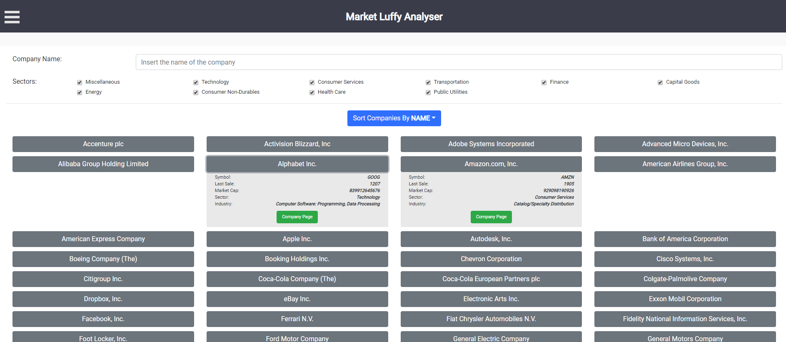
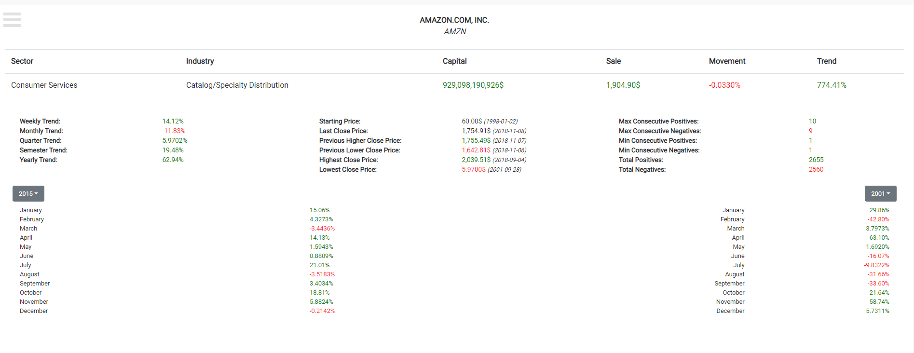
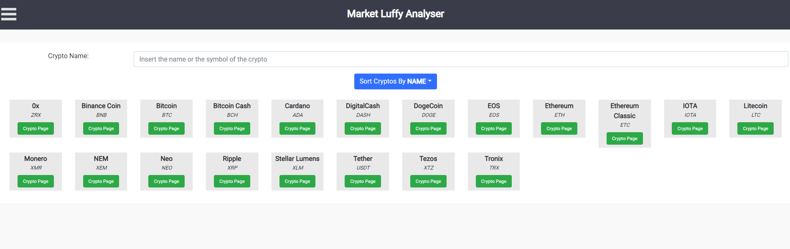
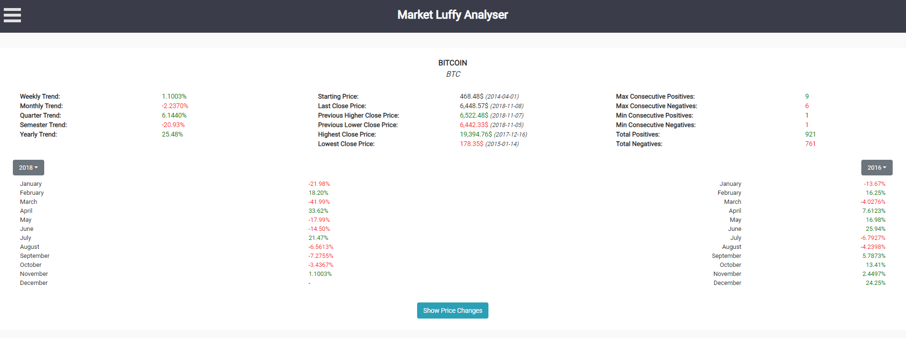
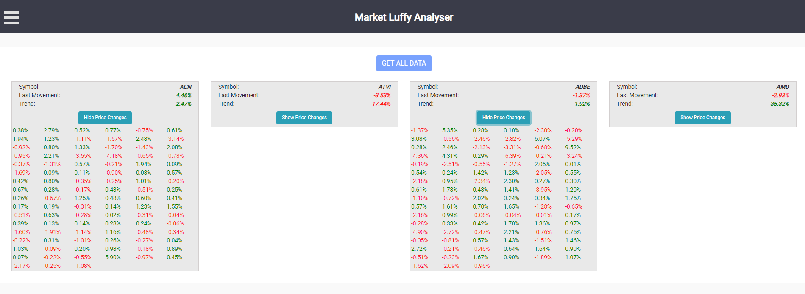

# market-luffy-analyser

This application offers a way to analyze the movements in the market of stocks and cryptos, and display useful statistics about them.

There are a client and a server applications. They both works locally.

## Installation

Checkout the repo and then switch inside the client and the server folders, running a `npm install` on these folders.

## Server

The server is an express application which creates a RESTful web service and a web socket in order to provide data to the client application.

In order to start the server application navigate into the `server` folder and execute the `npm start` task.

## Client

The client is a React application which displays the info provided by the server application.

In order to start the client application navigate into the `client` folder and execute the `npm start` task, being sure that the server application
is running in background.

## Screenshots

Few screenshots of the application.

